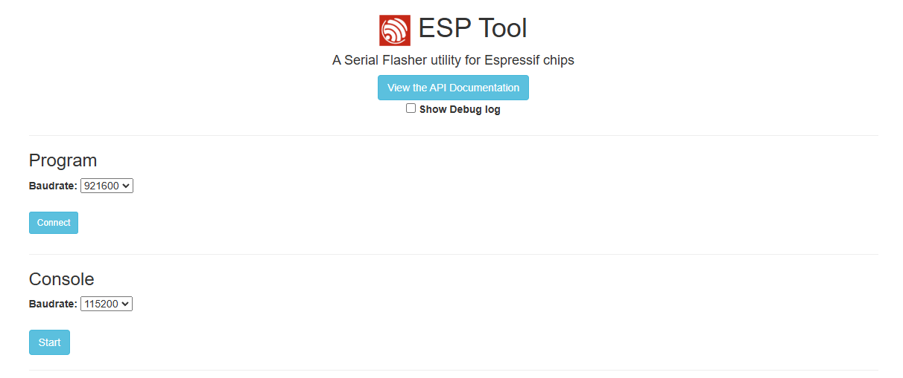
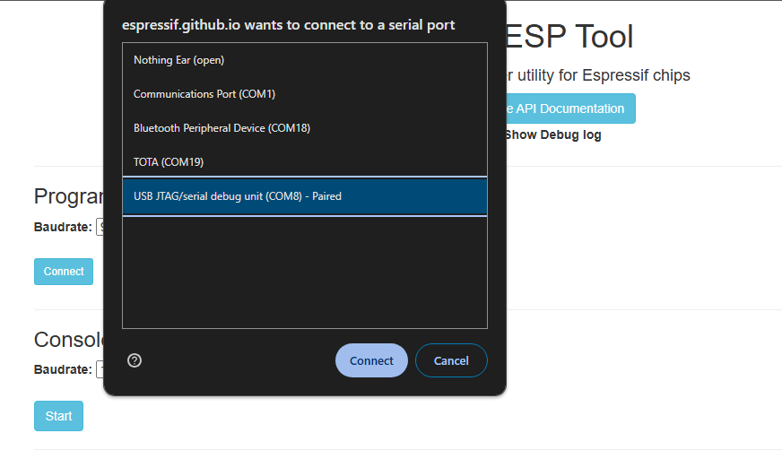
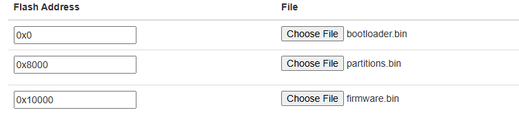

# VESC BLE UART BRIDGE

This is firmware for using an ESP32 as a Bluetooth module for VESC via UART. It's based on the original firmware that ships with the Little Focer V4 (thanks to Shaman) but has bug fixes for different MTU sizes and potential disconnect issues.

Other model ESP32 boards will work but the PlatformIO config will need to be adjusted.

This can be directly flashed to the Little Focer V4 via VSCode or with the instructions below.

### Flashing 
1. Connect the ESP32 to your PC via USB
2. Open the [web-based ESP Tool](https://espressif.github.io/esptool-js) and connect using default baudrate 
3. Load the three bin files using the pictured settings
4. Click "Program" and wait for flashing to complete

